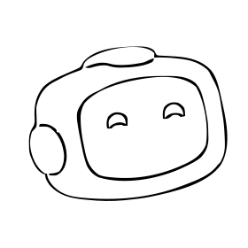

<div align="center">

  
  <h1>Cyren</h1>
  
  <p>
    An awesome assistant to keep you safe online 
  </p>
  
  
<!-- Badges -->
<p>
  
  
  <a href="https://github.com/stzyium/Cyren/blob/main/LICENSE">
    
  </a>
</p>
   
<h4>
    <a href="src/">Javascript</a>
  <span> · </span>
    <a href="c++/">
    C++</a>
  <span> · </span>
    <a href="python/">Python</a>
  </h4>
</div>

<br />

<!-- Table of Contents -->
# :notebook_with_decorative_cover: Table of Contents

- [About the Project](#star2-about-the-project)
  * [Screenshots](#camera-screenshots)
  * [Tech Stack](#space_invader-tech-stack)
  * [Features](#dart-features)
  * [Compatibility](#art-compatibility)
- [Getting Started](#toolbox-getting-started)
- [Todo](#compass-todo)
- [License](#warning-license)


<!-- About the Project -->
## :star2: About the Project
A cyber safety toolkit to keep you safe online, with awesome user interface built using react.js

<!-- Screenshots -->
### :camera: Screenshots

<div align="center"> 
  
</div>
<div align="center">
  
</div>
<div align="center">
  
</div>

<!-- TechStack -->
### :space_invader: Tech Stack

<details>
  <summary>Interface</summary>
  <ul>
    <li><a href="https://en.wikipedia.org/wiki/JavaScript">Javascript</a></li>
    <li><a href="https://vite.dev/">Vite.js</a></li>
    <li><a href="https://reactjs.org/">React.js</a></li>
    <li><a href="https://tailwindcss.com/">TailwindCSS</a></li>
  </ul>
</details>

<details>
  <summary>Application</summary>
  <ul>
    <li><a href="https://isocpp.org/">C++</a></li>
    <li><a href="https://crowcpp.org/master/">Crow</a></li>
    <li><a href="https://github.com/webview/webview">webview<a></li>
    <li><a href="https://python.org/">Python</a></li>
    <li><a href="https://github.com/pallets/flask">Flask</a></li>
    <li><a href="https://github.com/r0x0r/pywebview">pywebview</a></li>
  </ul>
</details>

<details>
<summary>Database</summary>
  <ul>
    <li><a href="https://sqlite.org/">SQLite</a></li>
  </ul>
</details>

<!-- Color Reference -->
### :art: Compatibility

| OS             | Supported                                                               |
| ----------------- | ------------------------------------------------------------------ |
| WINDOWS 11 | YES |
| WINDOWS 1O | NOT TESTED |
| LINUX | NO |
| OTHER | NO |


<!-- Getting Started -->
## 	:toolbox: Getting Started

Clone the repo
```bash
git clone https://github.com/stzyium/Cyren.git
```
Build the UI
```bash
cd Cyren
npm install
npm run build
```
Run the app using python (default port 18081)
```bash
cd python
pip install -r requirements.txt
pythonw main.pyw # no console
# Alternatively
# python main.py 
```
Or run with terminal (no webview)
```bash
python main.py --no-webview
```
<!-- Roadmap -->
## :compass: Todo

* [x] Reimplmention in c++ for standalone executable builds
* [ ] Fix CyrenAi content generator in cpp impl
* [ ] Newsfeed

## :warning: License

Distributed under the MIT License. See LICENSE for more information.